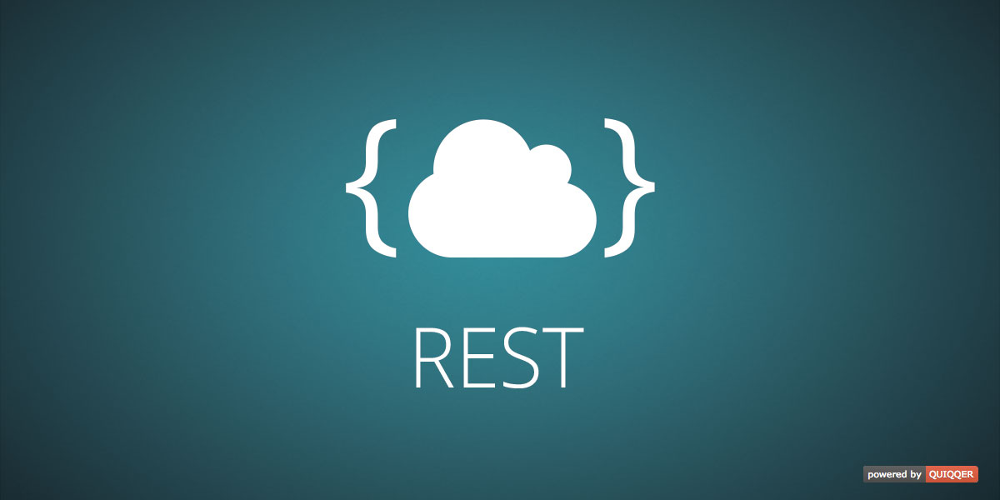

QUIQQER REST
========

With QUIQQER REST you are able to implement a REST Server in QUIQQER and create
packages that bring their own REST endpoints. 

Package Name:

    quiqqer/rest

Features
--------
* Build packages that provider their own custom REST API endpoints
* Based on Slim (https://www.slimframework.com/)

Usage
---
See our [Wiki](https://dev.quiqqer.com/quiqqer/package-rest/wikis/dev/package) for help (currently available in German only)

Installation
------------
The Package Name is: quiqqer/rest

Contribute
----------
- Project: https://dev.quiqqer.com/quiqqer/rest
- Issue Tracker: https://dev.quiqqer.com/quiqqer/rest/issues
- Source Code: https://dev.quiqqer.com/quiqqer/rest/tree/master

Support
-------
If you found any errors or have wishes or suggestions for improvement,
please contact us by email at support@pcsg.de.

We will transfer your message to the responsible developers.

License
-------
GPL-3.0+